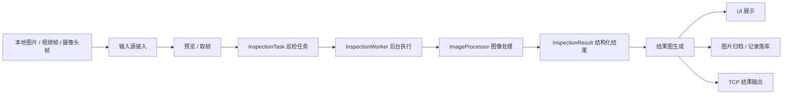
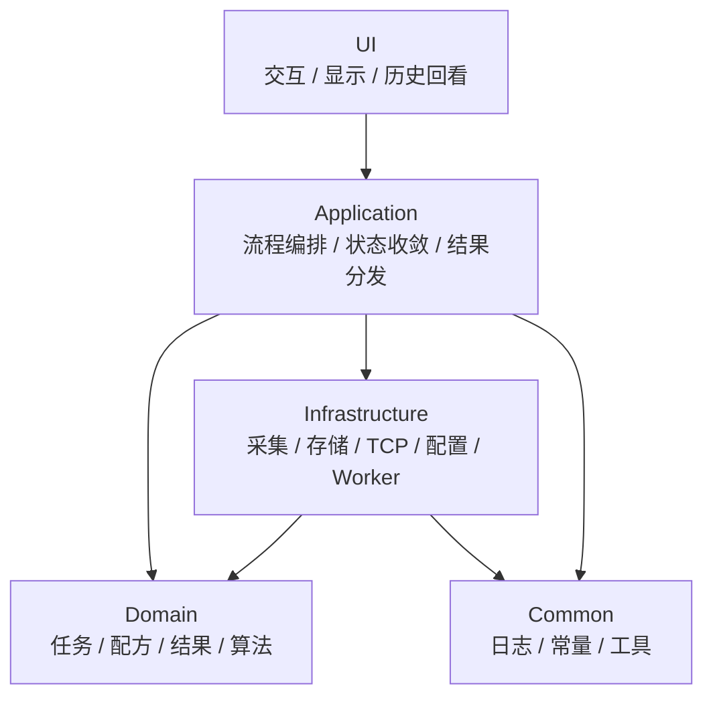
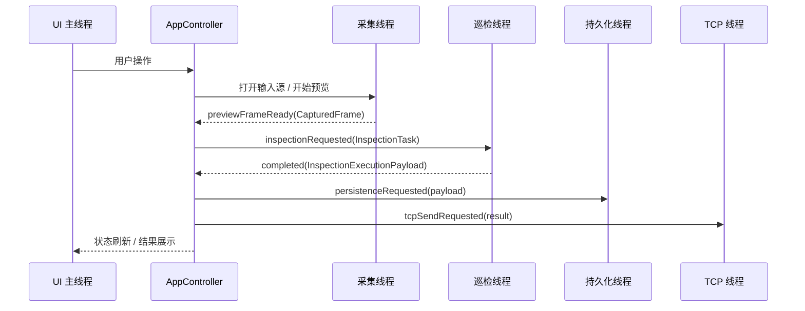

# industrial-OpenCV

`industrial-OpenCV` 是一个基于 **Qt/C++ + OpenCV** 的工业机器视觉上位机项目，面向 **单工位 AOI 外观检测工站** 场景。项目重点不是单一算法演示，而是围绕工业检测软件的完整业务链路，组织输入源接入、预览取帧、巡检任务、图像处理、结果判定、记录留痕和 TCP 输出。

项目适用方向：

- 工业检测上位机
- AOI 外观检测软件
- 机器视觉巡检软件
- 视觉测量与定位软件
- 检测结果留痕与通信回传终端

## 核心能力

- 支持本地图片单次巡检。
- 支持视频文件打开、预览和当前帧巡检。
- 支持摄像头打开、预览和当前帧巡检。
- 支持连续巡检，避免检测任务堆积。
- 支持 AOI 缺陷检测结果图显示。
- 支持 AOI 配方配置，包括 ROI、阈值、面积范围、形态学开关、留痕策略和发送策略。
- 支持原图 / 结果图归档和检测记录落库。
- 支持最近记录回看。
- 支持 TCP 结果输出和回执处理。

## 完整检测链路

项目主链路围绕真实 AOI 工站软件展开：

```text
输入源 -> 预览/取帧 -> 巡检任务创建 -> 图像处理 -> 缺陷判定 -> UI 展示 -> 图片归档 -> 记录落库 -> TCP 输出
```



这条链路体现项目的核心价值：图像从输入源进入系统后，会被封装为可追踪的巡检任务，经过算法处理和结果判定，再统一进入展示、留痕和通信出口。

## 架构分层

项目采用轻量分层结构，兼顾清晰边界和工程可维护性：

```text
ui/
application/
domain/
infrastructure/
common/
tests/
```



- `ui`：负责用户交互、参数录入、图像显示、结果展示、历史回看与状态反馈。
- `application`：负责接收 UI 请求、创建巡检任务、维护运行状态、分发结果到 UI / 存储 / 通信链路。
- `domain`：负责检测业务对象与核心算法处理，包括任务、配方、缺陷、结果、记录和图像处理逻辑。
- `infrastructure`：负责具体技术实现，包括输入源采集、后台 worker、TCP 通信、配置读写、图片归档和数据库记录。
- `common`：负责日志、常量、时间、图像格式转换等通用能力。

## 线程模型

项目采用 Qt 常见的 `QThread + worker object` 模式拆分后台任务：



- UI 主线程：主窗口、用户交互、状态同步和结果展示。
- 采集线程：输入源打开、关闭、预览与帧读取。
- 巡检线程：图像处理、缺陷检测与结果图生成。
- 持久化线程：图片归档和记录落库。
- 通信线程：TCP 连接、断开、结果发送和回执处理。
- 日志线程：日志异步写入与 UI 日志分发。

## 核心模型

- `Recipe`：AOI 配方，集中管理 ROI、阈值、面积范围、形态学开关、图片留痕策略和 TCP 发送策略。
- `CapturedFrame`：统一帧对象，封装 `cv::Mat`、输入源、帧号和采集时间。
- `InspectionTask`：一次巡检任务，包含任务 ID、输入帧和本次使用的配方快照。
- `InspectionResult`：结构化检测结果，包含 OK/NG、缺陷数量、缺陷明细、耗时、失败原因和摘要文本。
- `InspectionExecutionPayload`：巡检 worker 执行完成后的载荷，包含原始任务、结构化结果和结果图。
- `InspectionRecord`：检测记录，保存输入源、配方名、结果、摘要、图片路径和时间戳。

## 关键模块

- `AppController`：应用主控入口，连接 UI、采集、巡检、持久化和通信链路。
- `InspectionOrchestrator`：负责把文件路径或采集帧转换成标准巡检任务，并处理当前帧巡检和连续巡检门控。
- `ResultDispatcher`：负责把巡检结果收敛为 UI 展示结果，并触发持久化与 TCP 输出。
- `CaptureWorker`：输入源采集 worker，负责视频文件和摄像头的打开、关闭、预览和帧读取。
- `InspectionWorker`：后台巡检 worker，负责接收 `InspectionTask`、调用 `ImageProcessor`、回传执行结果。
- `ImageProcessor`：图像处理核心，负责 ROI、灰度转换、阈值化、形态学处理、轮廓提取和缺陷筛选。
- `InspectionPersistenceWorker`：持久化 worker，负责原图 / 结果图归档和检测记录保存。
- `TcpWorker`：TCP 通信 worker，负责连接、断开、结果发送和回执处理。
- `ConfigManager`：配置管理模块，负责配方、设备配置和输入源配置的读写与规范化。

## 工程设计要点

- 完整链路：覆盖从输入源到检测结果输出的 AOI 工站软件闭环。
- 多线程工程化：采集、巡检、持久化、通信和日志拆到后台 worker，避免 UI 阻塞。
- 任务建模：使用 `InspectionTask` 固化一次检测上下文，适合异步执行和结果追踪。
- 配方快照：检测任务携带配方快照，避免运行中参数变化影响已提交任务。
- 结果结构化：使用 `InspectionResult` 统一承接 OK/NG、缺陷明细、耗时和摘要。
- 结果追溯：保存原图、结果图、配方名、输入源、帧号和检测摘要，便于问题回看。
- 异步通信保护：TCP 发送携带设备配置快照，回调时校验上下文，避免旧任务污染当前连接状态。

## 主要技术实现

- 桌面框架：使用 Qt Widgets 实现上位机界面、状态刷新、图像显示和用户交互。
- 异步通信：使用 Qt Signal/Slot 组织 UI、控制层和后台 worker 之间的请求与回调。
- 后台任务：使用 `QThread + worker object` 拆分采集、巡检、持久化、TCP 通信和日志写入。
- 图像处理：使用 OpenCV 完成 ROI、灰度转换、阈值分割、形态学处理、轮廓提取和缺陷筛选。
- 数据留痕：使用 SQLite 保存检测记录，并归档原图和结果图。
- 结果通信：使用 TCP 输出检测结果，并处理连接、发送和回执状态。
- 工程构建：使用 CMake Presets 管理 MinGW / Ninja 构建流程。
- 单元测试：使用 Qt Test 和 ctest 覆盖核心算法、配置、编排、worker 和历史回看逻辑。

## 构建说明

项目使用 CMake 构建，并支持 MinGW / Ninja 环境。

调试构建：

```bash
cmake --preset mingw-debug
cmake --build --preset mingw-debug
```

发布构建：

```bash
cmake --preset mingw-release
cmake --build --preset mingw-release
```

当本地 Qt、OpenCV 或 vcpkg 路径不在默认搜索路径时，可以通过以下变量提供：

- `VISION_QT_ROOT`
- `VISION_VCPKG_ROOT`
- `VCPKG_TARGET_TRIPLET`
- `Qt6_DIR`
- `OpenCV_DIR`

## 运行说明

构建完成后，可执行文件位于对应构建目录中，例如：

```bash
build/mingw-debug/VisionInspectionSystem.exe
```

运行程序后，可执行以下典型流程：

```text
选择输入源 -> 打开/预览 -> 执行单次或当前帧巡检 -> 查看结果图 -> 查看历史记录 -> 发送 TCP 结果
```

## 测试

项目包含基础模块、应用编排和 worker 测试，覆盖以下方向：

- 图像处理
- 工具函数
- 配置管理
- 巡检会话状态
- 巡检编排
- 结果分发
- 巡检 worker
- 持久化 worker
- 历史记录回看

运行方式：

```bash
ctest --output-on-failure
```

测试目标包括：

- `VisionImageProcessorTests`
- `VisionUtilsTests`
- `VisionConfigManagerTests`
- `VisionInspectionSessionStateTests`
- `VisionInspectionOrchestratorTests`
- `VisionResultDispatcherTests`
- `VisionInspectionWorkerTests`
- `VisionInspectionPersistenceTests`
- `VisionHistoryReviewTests`
