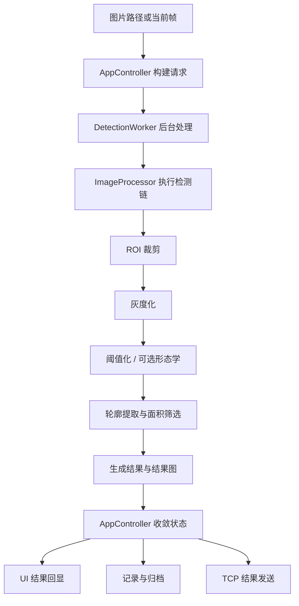
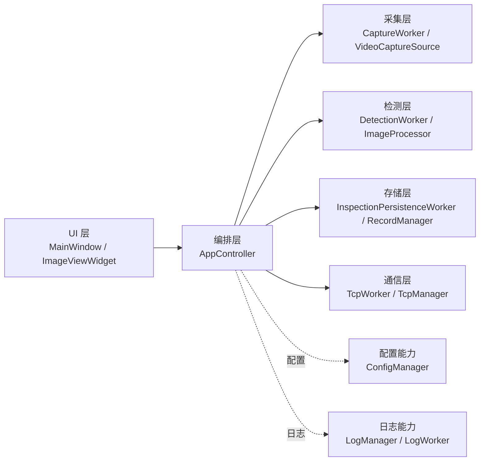

# Qt + OpenCV 视觉检测上位机

本项目是一个桌面端视觉检测上位机，目标是把输入接入、预览取帧、图像检测、结果展示、记录留痕与结果输出组织成一条清晰、可维护的工程主线。

## 项目概述

当前实现围绕一条完整闭环展开：

- 输入源接入
- 预览与当前帧获取
- 基于规则链的图像检测
- 结果图与状态展示
- 图片归档与记录保存
- 检测结果对外输出

这套工程更强调主流程打通、分层解耦和状态收敛，而不是复杂算法扩展。

## 功能范围

当前版本已经覆盖：

- 本地图片单次检测
- 视频文件预览与当前帧检测
- 摄像头输入能力接入
- 连续检测
- 结果回显
- 图片归档
- 检测记录保存
- TCP 结果输出与 ACK 回执

其中，单次检测和连续检测复用同一条检测主线，输入模式不同，但处理路径保持一致。

## 系统主流程



连续检测在单次检测主线上复用同一套处理链，当前策略是：

- 只处理最新帧
- 同一时刻只保留一个活动检测任务
- 不排队、不补帧

## 分层与架构



系统当前采用的组织方式是：

- `UI` 负责交互和结果展示
- `AppController` 负责主流程编排与状态收敛
- 采集、检测、存储、通信通过独立 worker 解耦
- 配置、数据库和日志作为通用基础能力复用

## 线程与异步模型

系统使用 `QThread + worker object` 模式组织后台任务。

- 主线程：`MainWindow`、`AppController`、UI 状态同步
- 采集线程：`CaptureWorker`
- 检测线程：`DetectionWorker`
- 持久化线程：`InspectionPersistenceWorker`
- 通信线程：`TcpWorker`
- 日志线程：`LogWorker`

异步交接规则保持统一：

- 请求由 `AppController` 发出
- worker 在线程内完成具体动作
- 结果统一回到 `AppController`
- 再由 `AppController` 分发到 UI、存储和通信链路

## 快速构建与运行

```powershell
cmake --preset mingw-debug
cmake --build --preset mingw-debug
.\build\mingw-debug\VisionInspectionSystem.exe
```

## 模块职责与边界

| 模块 | 主要对象 | 负责内容 | 不负责内容 |
| --- | --- | --- | --- |
| UI 层 | `MainWindow` | 用户交互、参数录入、图像与状态展示 | 业务编排、算法执行、数据库写入 |
| 编排层 | `AppController` | 主流程编排、状态管理、跨模块分发 | 具体采集、检测算法、底层 TCP 读写 |
| 采集层 | `CaptureWorker`、`VideoCaptureSource` | 输入源打开、读取帧、维护预览节拍 | 检测、持久化、UI 控件更新 |
| 检测层 | `DetectionWorker`、`ImageProcessor` | 图像处理、缺陷判断、结果图生成 | 输入源控制、数据库写入、TCP 发送 |
| 存储层 | `ConfigManager`、`InspectionPersistenceWorker`、`RecordManager` | 配置读写、图片归档、记录存储 | 业务调度、结果显示、通信 |
| 通信层 | `TcpWorker`、`TcpManager` | TCP 连接、结果发送、ACK 等待 | 结果生成、归档、UI 更新 |
| 日志层 | `LogManager`、`LogWorker` | 日志排队、异步落盘、UI 日志流 | 业务状态决策 |

### UI 层

- 负责采集用户输入，展示预览图、结果图和状态信息。
- 下游只连接 `AppController`，不直接触达 OpenCV、数据库或 socket。

### 编排层

- 负责组织输入源打开、预览、单次检测和连续检测。
- 负责维护采集态、检测态、通信态，并收敛 worker 回调。

### 采集层

- 负责图片之外的帧输入接入与预览取帧。
- 向上层提供统一的帧数据模型和采集状态快照。

### 检测层

- 负责执行检测链、取消检测和结果图生成。
- 处理核心图像逻辑，包括 ROI、灰度化、阈值化、形态学和轮廓筛选。

### 存储层

- 负责配置读写、图片归档和 SQLite 记录落库。
- 管理记录索引与最近记录读取。

### 通信层

- 负责 TCP 连接生命周期、结果发送和 ACK 等待。
- 对外只承接连接和发送请求，不决定何时发送。

### 日志层

- 负责统一日志入口、异步落盘和 UI 日志流转发。
- 不承担业务补救或状态机职责。

## 设计思想

这个项目当前遵循的核心设计思想主要有以下几条：

### 1. 控制层收敛主流程

`AppController` 作为流程中轴，统一承接 UI 请求、worker 回调和状态变化，避免界面层或单个 worker 直接持有整条链路状态。

### 2. 能力解耦而不是逻辑堆叠

采集、检测、存储、通信、日志分别拆成独立层和独立 worker。这样每一层都只处理自己的职责，后续改动也更容易找到落点。

### 3. 单次检测与连续检测共用同一检测主线

不同输入模式下不重新发明一套检测逻辑，而是复用同一条处理链，保证规则一致、结果路径一致、后处理链路一致。

### 4. 结果处理继续沿主链闭环

检测完成后，不只停在结果展示，而是继续进入记录、归档和结果输出链路，使系统保持完整的工程闭环。

### 5. 工程可维护性优先于功能堆叠

当前实现重点是让输入、检测、状态、存储和通信之间的关系清楚、边界清楚、责任清楚，而不是在主线未稳之前继续叠加更多功能。

## 问题定位入口

如果出现问题，可以按现象优先定位：

- 无画面或输入源异常：优先看采集层
- 有画面但无检测结果：优先看编排层和检测层
- 有结果但无记录或图片未落盘：优先看存储层
- 有结果但未发送或 ACK 异常：优先看通信层
- 界面显示异常或状态不同步：优先看 UI 层和编排层
