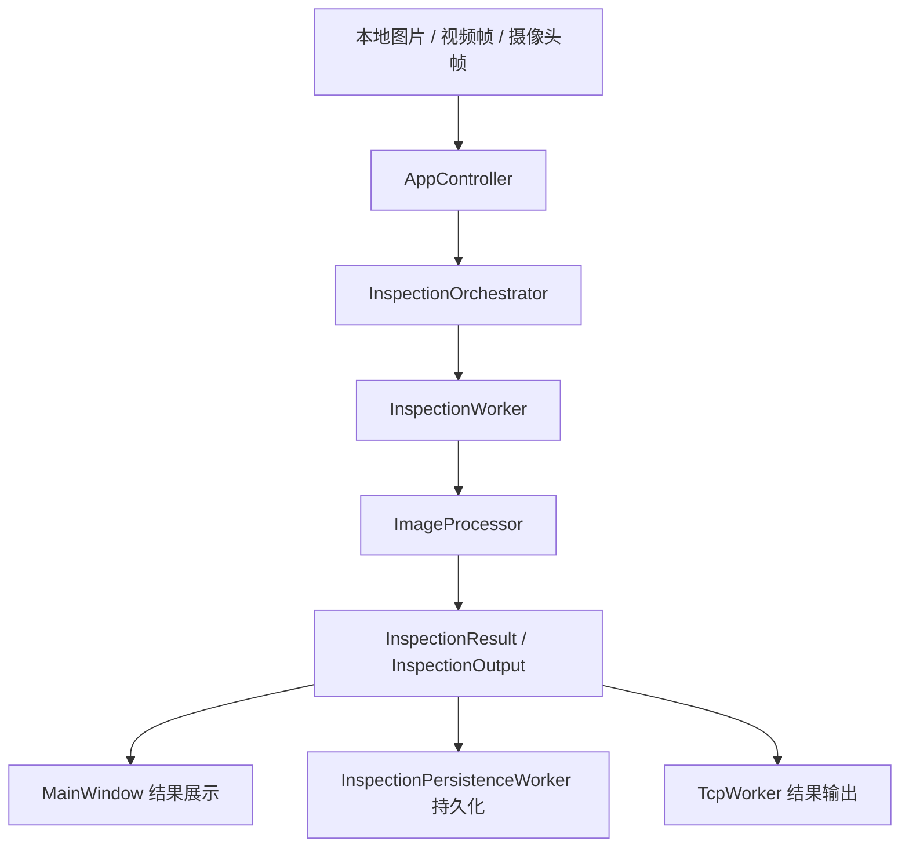

# industrial-OpenCV

`industrial-OpenCV` 是一个基于 Qt + OpenCV 的工业机器视觉上位机项目，当前项目题材固定为：

`单工位 AOI 外观检测工站`

项目围绕输入源接入、预览取帧、检测任务编排、缺陷判定、结果展示、记录留痕与 TCP 输出等完整桌面端视觉业务流程展开。

项目面向典型工业视觉软件场景，例如：

- 外观检测
- AOI 检测
- 尺寸测量
- 定位识别
- OCR 辅助识别
- 视觉检测结果回传

本项目重点不在单一算法样例，而在于构建一套清晰、可维护、可继续扩展，并且更贴近真实设备岗位语境的 Qt/C++ AOI 检测工站骨架。

## 功能特性

当前版本提供以下能力：

- 本地图片单次巡检
- 视频文件打开与预览
- 摄像头打开与预览
- 当前帧巡检
- 连续巡检
- AOI 缺陷结果图显示
- 原图 / 结果图归档
- 记录持久化保存
- TCP 结果输出
- 最近记录回看
- AOI 配方名、检测项开关、留痕策略与结果发送策略配置

## 系统主流程

项目围绕一条完整的 AOI 工站主链路展开：

`输入源 -> 预览/取帧 -> 检测任务创建 -> 图像处理 -> 缺陷判定 -> UI 展示 -> 图片归档 -> 记录落库 -> TCP 输出`

对应流程如下：



## 架构设计

项目采用分层结构组织代码，按职责分为：

```text
application/
  controllers/
  orchestrators/
  state/
common/
  config/
  logging/
  utils/
domain/
  entities/
  policies/
  services/
infrastructure/
  capture/
  communication/
  config/
  storage/
  vision/
tests/
ui/
```

### `ui/`

界面层，负责：

- 用户交互
- 输入参数录入
- 图像显示
- 结果展示
- 日志过滤与查看

### `application/`

应用编排层，负责：

- 接收 UI 请求
- 创建巡检任务
- 管理巡检会话状态
- 分发结果到 UI、存储和通信链路

### `domain/`

领域层，负责核心业务对象与图像处理逻辑，包括：

- `InspectionTask`
- `InspectionResult`
- `InspectionOutput`
- `Recipe`
- `CapturedFrame`
- `ImageProcessor`

### `infrastructure/`

基础设施层，负责具体外部能力接入，包括：

- 输入源采集
- TCP 通信
- 配置读写
- 记录存储
- 后台巡检 worker

### `common/`

公共基础能力，负责：

- 常量定义
- 日志能力
- 通用工具函数

## 核心对象

项目中的关键业务对象包括：

- `InspectionTask`
  表示一次巡检任务，包含输入图像、来源信息、配方、任务编号等上下文。

- `InspectionResult`
  表示一次检测的最终结果，包含 OK/NG、缺陷数量、缺陷明细、耗时、失败原因和摘要信息。

- `DefectItem`
  表示单个 AOI 缺陷明细，包含缺陷框、面积、类别与缺陷说明。

- `InspectionOutput`
  表示巡检完成后的统一出口对象，用于 UI 展示、持久化和 TCP 输出。

- `Recipe`
  表示 AOI 配方配置，例如配方名、检测项开关、阈值、面积范围、ROI、形态学开关、图片留痕策略和结果发送策略。

- `InspectionSessionState`
  表示巡检运行状态，包括运行中、取消中、连续巡检开关、活动任务 ID 等。

- `InspectionOrchestrator`
  负责把文件路径或采集帧转换成标准巡检任务，并进行连续巡检门控。

- `ResultDispatcher`
  负责把巡检输出发送到持久化与 TCP 输出链路。

## 线程模型

项目采用 Qt 常见的 `QThread + worker object` 模式组织后台任务：

- UI 主线程
  负责主窗口、状态同步和用户交互。

- 采集线程
  负责输入源打开、关闭、预览与帧读取。

- 巡检线程
  负责图像处理与巡检执行。

- 持久化线程
  负责记录保存和图片归档。

- 通信线程
  负责 TCP 连接和结果发送。

- 日志线程
  负责日志异步写入与 UI 日志流分发。

## 主要模块

项目当前包含以下主要模块：

- `AppController`
  主流程控制入口，连接 UI 与后台链路。

- `CaptureWorker`
  输入源采集 worker，负责视频文件和摄像头预览。

- `InspectionWorker`
  后台巡检 worker，负责执行图像巡检任务。

- `ImageProcessor`
  图像处理核心模块，负责图像转换、阈值化、形态学处理、轮廓筛选等逻辑。

- `InspectionPersistenceWorker`
  持久化 worker，负责记录保存与图片归档。

- `TcpWorker`
  TCP 通信 worker，负责连接、断开和结果发送。

- `ConfigManager`
  配置管理模块，负责配方、设备配置和输入源配置读写。

## 构建说明

项目使用 CMake 构建，并提供了 MinGW/Ninja 预设。

### 使用 CMake Presets

调试构建：

```bash
cmake --preset mingw-debug
cmake --build --preset mingw-debug
```

发布构建：

```bash
cmake --preset mingw-release
cmake --build --preset mingw-release
```

### 可选环境变量 / CMake 变量

当本地 Qt、OpenCV 或 vcpkg 路径不在默认搜索路径时，可以通过以下变量提供：

- `VISION_QT_ROOT`
- `VISION_VCPKG_ROOT`
- `VCPKG_TARGET_TRIPLET`
- `Qt6_DIR`
- `OpenCV_DIR`

## 运行说明

构建完成后，可执行文件位于对应构建目录中，例如：

```bash
build/mingw-debug/VisionInspectionSystem.exe
```

运行程序后，可根据输入源类型执行以下操作：

- 选择本地图片进行单次巡检
- 打开视频文件并预览
- 打开摄像头并预览
- 对当前帧执行巡检
- 启动或停止连续巡检
- 查看最近记录并回看历史图片

## 测试

项目包含一组基础模块与应用层测试，覆盖以下方向：

- 图像处理
- 工具函数
- 配置管理
- 巡检会话状态
- 巡检编排
- 结果分发
- 巡检 worker
- 持久化 worker

运行方式：

```bash
ctest --output-on-failure
```

## 依赖

项目主要依赖：

- Qt Widgets
- Qt Network
- Qt Sql
- OpenCV
- SQLite

## 适用方向

该项目适合作为以下类型软件的开发基础：

- 工业检测上位机
- 机器视觉巡检软件
- AOI 检测软件
- 视觉测量软件
- 结果留痕与回传型视觉终端
