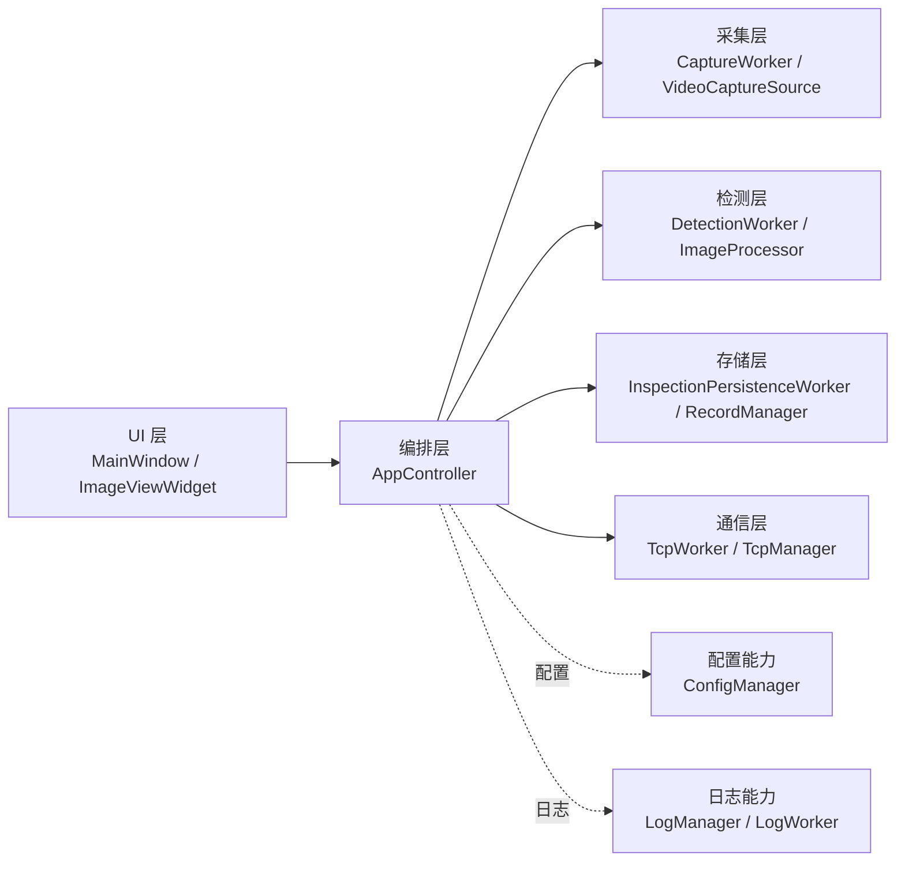
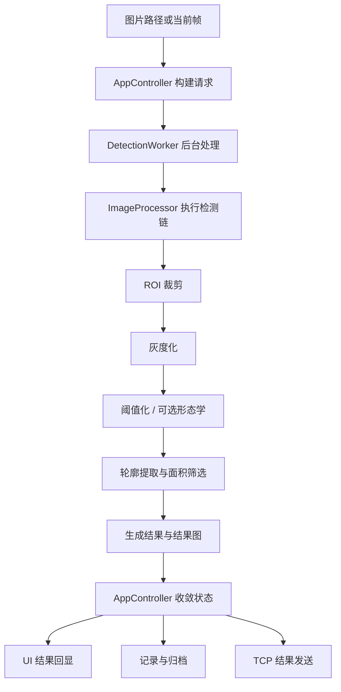

# 系统总览

## 1. 项目定位

当前项目是一个桌面端视觉检测上位机，目标是把输入、检测、结果展示、记录留痕和通信输出组织成一条清晰、可维护的工程主线。

当前实现已经覆盖：

- 本地图片单次检测
- 视频文件预览与当前帧检测
- 摄像头输入能力接入
- 连续检测
- 结果回显、图片归档、数据库记录
- TCP 结果输出与 ACK 回执

## 2. 系统分层

系统当前采用的组织方式是：

- `UI` 负责交互和结果展示
- `AppController` 负责主流程编排与状态收敛
- 采集、检测、存储、通信通过独立 worker 解耦
- 配置、数据库和日志作为通用基础能力复用

## 3. 主流程

连续检测在单次检测主线上复用同一套处理链，当前策略是：

- 只处理最新帧
- 同一时刻只保留一个活动检测任务
- 不排队、不补帧

## 4. 线程与异步模型

系统目前使用 `QThread + worker object` 模式组织后台任务。

- 主线程：`MainWindow`、`AppController`、UI 状态同步
- 采集线程：`CaptureWorker`
- 检测线程：`DetectionWorker`
- 持久化线程：`InspectionPersistenceWorker`
- 通信线程：`TcpWorker`
- 日志线程：`LogWorker`

异步交接规则保持统一：

- 请求由 `AppController` 发出
- worker 在线程内完成具体动作
- 结果统一回到 `AppController`
- 再由 `AppController` 分发到 UI、存储和通信链路

## 5. 实现范围

当前工程主线更关注完整闭环，而不是复杂算法扩展。现阶段的实现重点包括：

- 输入源接入与预览取帧
- 基于 ROI、灰度化、阈值化、形态学和轮廓筛选的规则检测链
- 结果图生成与界面回显
- 文件系统归档与 SQLite 记录
- TCP 结果输出与 ACK 回执

其中数据库保存记录和图片路径，原图与结果图存放在文件系统中。
